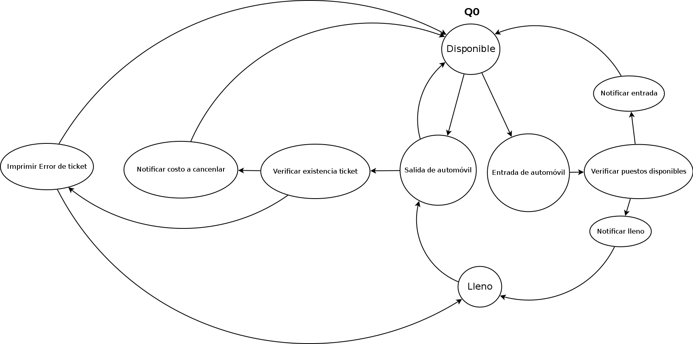

#Marco teórico
##Análisis preliminar

##Justificaciones
1. ¿Qué tipo de sockets decidió emplear?

Para realizar la transmisión de la información se decidió utilizar Protocol de Datagramas de Usuario (User Datagram Protocol en inglés), un protocolo no orientado a conexión. El Protocolo UDP es un protocolo de la capa de transporte para uso con el protocolo IP de la capa de red. El protocolo UDP proveé un servicio de intercambio de datagramas a través de la red en modo Best-Effort, es decir, que no puede asegurar la entrega de los datagramas o paquetes. 

Debido a que se requiere un tiempo de respuesta inmediato para minimizar, en lo posible, el tiempo de espera en la entra o salida de los automoviles en el estacionamiento, es necesario que la velocidad de transmisión del paquete se maximize. UDP se suele utilizar cuando se buscan transmisiones con una cantidad de información baja en los paquetes y altas velocidades de transferencia (aunque se puedan perder algunos paquetes como efecto adverso) por lo que para el caso actual puede satisfacer la solicitud. 

El protocolo TCP, sin embargo, también pudiese satisfacer la 

2. Identifique todos los mensajes del sistema, indicando: el formato del mismo,
su tamaño en bytes, quién genera el mensaje y quién lo recibe y procesa.

El cliente...

Cuando el servidor recibe una petición de un ticket nuevo por parte de un cliente, el primero envía un mensaje de 16 bytes en formato BDDMMYYYYHHMMSSS
el cual se encuentra representado en el siguiente formato:

* B: Booleano indicando si hay puestos disponibles
* D: Día en el cual se creó el ticket
* M: Mes
* Y: Año
* H: Hora
* M: Minutos
* SSS: Código del ticket, el cual es un número entre el 000 y el 199 ó XXX en el caso de que no se haya generado el ticket debido a limite de carros alcanzado.

3. Realice el diseño completo del protocolo de comunicación que construya y
describa como opera el mismo, debe usar UDP como capa de transporte.
Incluya el punto de vista de los cambios de estado de las entidades que se
comunican. Se sugiere usar diagramas de máquinas de estados finitos y
facilitar la explicación de como es la actividad del protocolo.

---

4. Describa aspectos del proyecto que funcionan según el enunciado y cuales
no. Cualquier requerimiento no desarrollado o que contenga fallas, deberá
ser señalado claramente.

Para la implementación del proyecto, pensando en la confiabilidad de la entrega de los clientes al servidor y visceversa decidimos trabajar con un thread en el servidor el cual se encargará únicamente de almacenar todos los mensajes que son recibidos, inicialmente este trabajo lo realizaba la ejecución principal del programa, pero entre la recepción de un mensaje, el procesamiento y respuesta al mismo podían llegar peticiones de otros clientes las cuales se perderían. Para poder llevar a cabo esta idea se implementó un buffer circular en el cual el thread escribe todos los mensajes que recibe, mientras que el procedimiento principal se encuentra a la espera de escrituras en el buffer para procesar y responder estos mensajes en un socket de solo salida, de esta manera el servidor ofrece alta disponibilidad a sus clientes aprovechando el modelo concurrente de productor consumidor.

Los tickets se implementaron de tal manera que el usuario no intervenga en el proceso del manejo del identificador único para los puestos. Cuando un cliente solicita un ticket, se le asigna un "código de barra" el cual contine un entero entre 0 y 199 (serial), independientemente del serial proporcionado, al momento del salir, el ticket leido debe contener uno de estos seriales

Al cierre del día las bitácoras de salida no necesitan actualizaciones, ya que cada operación de entrada o salida queda escrita al momento. El servidor esta diseñado para estar activo de forma continua.

Los servicios simultáneos son recibidos en el orden en que el flujo de la red los proporciona, el socket siempre se encuentra activo en el hilo paralelo.

6. Opcional: Construya un aplicación confiable, que garantice la entrega, evite
información duplicada y pérdida de información. Todos estos controles
deben estar en capa de aplicación.