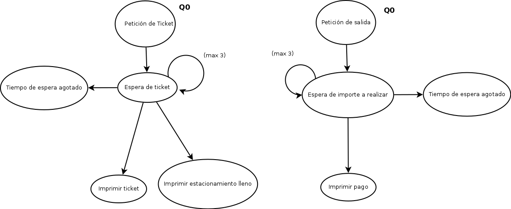

\newpage

#Justificaciones

##¿Qué tipo de sockets decidió emplear?

Para realizar la transmisión de la información se decidió utilizar Protocol de Datagramas de Usuario (User Datagram Protocol en inglés), un protocolo no orientado a conexión. El Protocolo UDP es un protocolo de la capa de transporte para uso con el protocolo IP de la capa de red. El protocolo UDP provee un servicio de intercambio de datagramas a través de la red en modo Best-Effort, es decir, que no puede asegurar la entrega de los datagramas o paquetes. 

Debido a que se requiere un tiempo de respuesta inmediato para minimizar, en lo posible, el tiempo de espera en la entra o salida de los automóviles en el estacionamiento, es necesario que la velocidad de transmisión del paquete se maximize. UDP se suele utilizar cuando se buscan transmisiones con una cantidad de información baja en los paquetes y altas velocidades de transferencia (aunque se puedan perder algunos paquetes como efecto adverso) por lo que para el caso actual, se puede satisfacer la solicitud. 

El protocolo TCP, sin embargo, también pudiese satisfacer los requisitos de este proyecto aunque, debido los mecanismos de establecer y verificar la conexión, no sería el tipo de socket ideal para el requerimiento.

##Mensajes del sistema

###Mensajes enviados por el servidor

####Caso de puesto disponible/no disponible

Cuando el servidor recibe una petición de un ticket nuevo por parte de un cliente, el primero envía un mensaje de 16 bytes en formato BDDMMYYYYHHMMSSS, en el cual cada campo representa:

* B: Booleano indicando si hay puestos disponibles
* D: Día en el cual se creó el ticket
* M: Mes
* Y: Año
* H: Hora
* M: Minutos
* SSS: Código del ticket, el cual es un número entre el 000 y el 199 ó XXX en el caso de que no se haya generado el ticket debido a limite de carros alcanzado.

Este mensaje es recibido y procesado por el cliente.

####Caso salida de automovil con serial existente en el estacionamiento

Cuando el servidor recibe una petición de salida por parte de un cliente con serial existente en el estacionamiento, el primero envía un mensaje de 16 bytes en formato XMMMMMMMMMMMMMMM, en el cual cada campo representa:

* X: Caracter 'X' utilizado para el determinismo de los caso al momento del parseo.
* MMMMMMMMMMMMMMM: Monto a cancelar.

Este mensaje es recibido y procesado por algún cliente.

####Caso salida de automovil con serial inexistente en el estacionamiento

Este caso, en la vida real, no procede ya que es necesario escanear el código de barras del ticket emitido y no introducir el serial manualmente. En el supuesto caso de un serial incorrecto, el serial no envía ningún mensaje y el cliente se queda en espera hasta obtener un mensaje de "Tiempo de espera agotado".

###Mensajes enviados por el cliente

####Entrada/salida de vehículo al estacionamiento

Cuando ingresa/egresa un nuevo automovil, el cliente emite un mensaje al servidor. Este mensaje consta de 4 bytes representado en el siguiente formato: OSSS, en el cual cada campo representa:

* O:   Tipo de Operación a realizar ('e' para entrada o 's' para salida).
* SSS: Serial del vehículo (Para el caso de entrada, esta información es ignorada por el servidor). 

Este mensaje es recibido y procesado por el servidor mediante el uso de un hilo dedicado a ello. Este emite una respuesta al cliente (ver Mensajes enviados por el servidor).

## Diseño de protocolo

Aquí se puede observar que el servidor inicia en el estado q0 (puestos disponibles),  luego al recibir una petición de entrada verifica la existencia de puestos y entrega el ticket  o notifica que no hay puestos y regresa al estado de diponible  o lleno dependiendo del caso. En caso de que se reciba una petición de salida se calcula el costo que debe pagar el usuario y se le notifica al usuario, el caso de "imprimir error de ticket" nunca ocurre ya que esto se maneja de forma automática con los códigos de barra, pero se agrego como protección al servidor.

---

Un cliente al realizar una petición de entrada pasa a un estado de espera el cual se repite hasta 3 veces (en caso de no respuesta por parte del servidor), en el caso de llegar a recibir un mensaje procede a imprimir el ticket del usuario o un mensaje indicando qu el estacionamiento está lleno. 

De forma análoga ocurre cuando el cliente solicita la salida, como resultado se imprime el pago a realizar.

## Aspectos funcionales

Para la implementación del proyecto, pensando en la confiabilidad de la entrega de los clientes al servidor y visceversa decidimos trabajar con un thread en el servidor el cual se encargará únicamente de almacenar todos los mensajes que son recibidos, inicialmente este trabajo lo realizaba la ejecución principal del programa, pero entre la recepción de un mensaje, el procesamiento y respuesta al mismo podían llegar peticiones de otros clientes las cuales se perderían. Para poder llevar a cabo esta idea se implementó un buffer circular en el cual el thread escribe todos los mensajes que recibe, mientras que el procedimiento principal se encuentra a la espera de escrituras en el buffer para procesar y responder estos mensajes en un socket de solo salida, de esta manera el servidor ofrece alta disponibilidad a sus clientes aprovechando el modelo concurrente de productor consumidor.

Los tickets se implementaron de tal manera que el usuario no intervenga en el proceso del manejo del identificador único para los puestos. Cuando un cliente solicita un ticket, se le asigna un "código de barra" el cual contine un entero entre 0 y 199 (serial), independientemente del serial proporcionado, al momento del salir, el ticket leido debe contener uno de estos seriales

Al cierre del día las bitácoras de salida no necesitan actualizaciones, ya que cada operación de entrada o salida queda escrita al momento. El servidor esta diseñado para estar activo de forma continua.

Los servicios simultáneos son recibidos en el orden en que el flujo de la red los proporciona, el socket siempre se encuentra activo en el hilo paralelo.

La pérdida de información desde el servidor hacia el usuario es manejado por el cliente el cual realiza hasta 3 esperas temporizadas de 30 segundos para desistir.

\newpage

# Referencias

##Documentación sobre C y sockets 

* Difference in UNIX Domain Sockets: SOCK_DGRAM vs SOCK_STREAM
    - http://www.linuxquestions.org/questions/programming-9/difference-in-unix-domain-sockets-sock_dgram-vs-sock_stream-624041/

* Sockets Tutorial
    - http://www.linuxhowtos.org/C_C++/socket.htm

* Strings in C
    - http://www.tutorialspoint.com/cprogramming/c_strings.htm

##Referencias teóricas

* Network socket
    - https://en.wikipedia.org/wiki/Network_socket

* UDP (User Datagram Protocol)
    - http://searchsoa.techtarget.com/definition/UDP

* UDP, User Datagram Protoco
    - http://www.networksorcery.com/enp/protocol/udp.htm

* User Datagram Protocol
    - https://es.wikipedia.org/wiki/User_Datagram_Protocol

